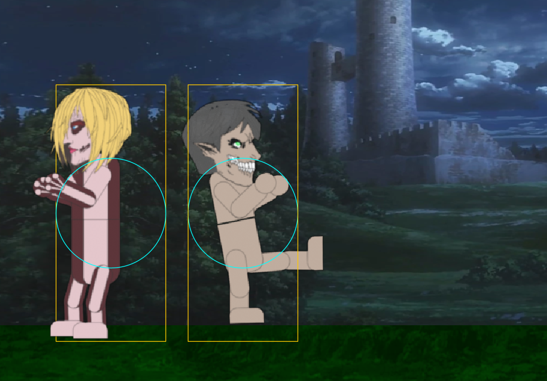
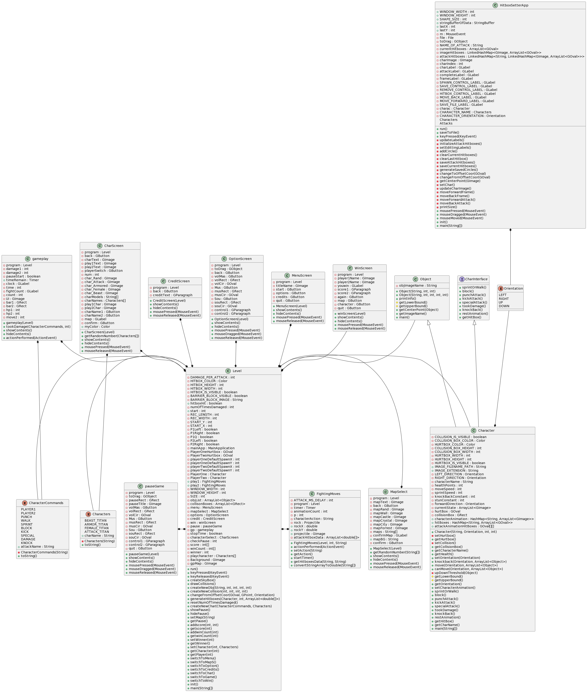
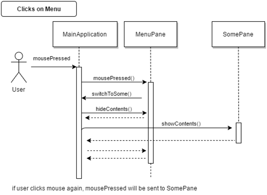
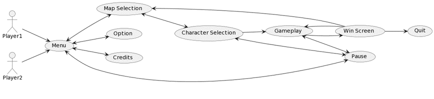
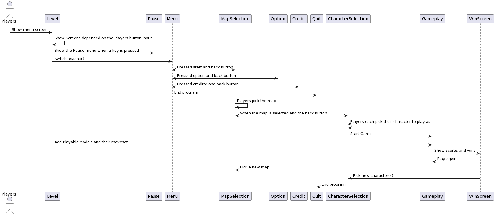

# COMP055 Final Project - AOT: Lets Rumble
*2D Attack on Titan Fighting Game*

## Overview of Project
AOT: Lets Rumble is a 2D fighting game based on street fighter programmed in Java. 
The game was created over the course of 4 weeks by 4 team members with the use of Java's ACM Graphics library, Blender, and prior class labs to create this game. 

Celebrating the end of the Attack of Titan anime, the game can be downloaded and played on one computer and a single keyboard by two people. A monitor that is a minimum of 1285 x 690 is required to play the game. 

Use GitHub's table of contents button at the top left to navigate through the readme.

## What features are implemented and what has not yet been implemented
Menu class has mainly combine with the level class and level switch to classes to show a different screen for the players to navigate.
A Hitbox class was created and some hitbox function were created in Level class.
The Beast titan projectile does not work in the game.
Titana special ability aren’t implemented in the game due to time.
The milestone are very different as the start time for coding was late in the semester and due to this play testing did not take a week to do according to the plan of work.
The hitbox is visible which were meant to be not visible but due the limited amount of time, the hitboxes were visible due to testing.
There are less characters implemented in the game from seven to four due to limited amount of time.
There are no jumping in the game as weeks we had were not enough to implemented and polish the jump action in the game.
The animation is larger then first thought of in the earlier.
The damage is the same but could be change in future update.
Players can not change their control.
Character sound effect weren’t implemented.

## How to build and use the project / play the game
The player would first start the game. The screen will then transition to a map selection screen, basically choosing what environment they will be fighting in. Once the confirm bitton is pressed, the screen will transistion to a character selection menu where the players can select which character they want to choose -- pressing the Character select button at the top to switch between each players' selection. After the confirm button is pressed, the screen transitions to the fighting stage where the players battle it out for supremacy. Players can pause the fight using the backspace to check controls or quit the game, and resume the fight with the backslash. Lastly, when one of the players win, the screen changes to a win screen where players can fight again, reselect the map, change their characters, or quit the game.

## Customer Statement of Requirements
For our project, we wanted to create a fighting game that has never been made before. Knowing that the most action-packed anime, “Attack on Titan”, is coming to an end, we decided to develop a fighting game dedicated to its characters. This show has captured audiences around the world and has gone viral throughout the internet – even reaching our team. This show was the main inspiration for the theme of our game and has given many ideas for character design and character movements. We also wanted to create something that would never get boring and allow people to play with their friends and family. This motivated and inspired us to create a fighting game where you can go head-on against your friends and with the different characters, and their unique moves, make a game people would keep playing.
Today, people are looking for a game with a fast-paced, competitive 1v1 format that involves hand-eye coordination and requires players to try and predict their opponent's moves. This is the major problem with every fighting game and if one does not meet these criteria, then it can get very boring and repetitive. Another key aspect people are looking for in a fighting game is a good community. People look forward to having a friendly and engaging community for a game where people can connect and compete with each other. For our game, there is a large community of people who have watched and loved “Attack on Titan”, so creating a game based on the show’s characters would draw in a huge fan base – giving our game a community of players. Also, with our game having many unique characters with certain unique moves, players will never get bored and constantly play against each other using different character combinations. Finally, people seem to lean towards playing on the PC when doing fighting games such as Fortnite, LeageofLegends, and World of Tanks. Therefore,  we see that programming a fighting game meant for the PC would be the best option (Figure 1).
	So far, game studios have tried to solve the desires of the people by trying to create games that meet their preferences. According to IGN, the top ten best fighter games have multiplayer content, many unique moves and combos, and the ability to choose your characters (Figure 2). With a variety of games that provide such content, the gaming community will never get bored and will always discover new techniques and strategies for each game – making these games refreshing and endlessly entertaining. And, as more games come out, older characters no longer change in play style but to compensate they add new characters and DLCs to always keep the community entertained – as shown with every new release.

 Figure 1

 Figure 2

## Functional Requirements

**Main Menu:** The player first enters the menu of the game from which they can choose to start the game, see options, credits, or quit the game. Beginning with options, the option menu shows the player the controls to control the player1 and player2 characters and audio adjustment bars. While not implemented entirely, future work may focus on adding user customizable controls for player1 and player2. Credits show the creators of the game. See figure 3.

 Figure 3 

**Start Menu:** Moving onto the start menu, one player could select a map from 5 maps that can be choosen at random or explicitly. See figure 4 for map selection.

 Figure 4

**Character Selection:** Then moving onto the character selection, both players could select from either the Attack Titan, Beast Titan, Female Titan, or Armored Titan. If the players so choose, they can also press the question mark in the middle for the game to randomly select a character for them. In the interests of gameplay, both players could select the same character if they desire. See figure 5 for character selection screen.

 Figure 5

**Gameplay:** Upon pressing confirm, both players are directed to the gameplay. Both players could the deploy the general moves of punch (figure 6), kick (figure 7), and a character specific move called a special. Each attack differs by their range, quickness of movement, and damage. The punch is the fastest attack, comparatively long range, but small damage. The kick is meant to be a longer range attack with medium damage at the cost of a longer start up time. Lastly, the special attack unique to that character does the most damage and knockback out of all of a character's attacks. The range and quickness of a character's special is meant to be different from other characters to allow for dynamic gameplay that will allow players to strategize and develop new techniques for each character for ever refreshing gameplay. 

Punch Attack:

 Figure 6

Kick Attack Image:

 Figure 7

Knockback is inflicted upon the enemy when they are hit by an attack. Knockback is the same for eveyr attack, but future work will have that changed so that every attack will have their own unique knockback.

To avoid taking damage and knockback from the enemy, players must master their character's movement and use their block ability to obtain immunity from enemy attacks and knockback for a specific duration. 

While some of this use case was implemented, due to the time frame of the project, we were unable to make each character attack that much different from each other. From game testing, we found the attack to just be the best attack because it dealt the same damage as the other attacks at the fastest speed and largest range. In future work, we plan to further differentiate each attack. 

Additionally, we were unable to fully implement every titan's (character's) special ability. For instance, the Beast Titan was meant to throw a stone for his special. On the other hand, the Armored Titan was meant to duck and ram into other characters for his special. In future work, we plan to add these special attacks to make gameplay more dynamic. 

**Unadded Gameplay Use Cases:** For the gameplay use case, we also planned on having sharp player movement that would make the gameplay fast-paced, exciting, and technical. However, our game engine became extremely laggy when players spammed inputs, resulting in our movement becoming extremely laggy as well. Additionally, we were not able to add sprint movement, making our gameplay extremely sluggish and monotonous even when the game engine was not lagging. In the future, we plan to add a sprint mechanic in the game and potentially looking into an game engine library that we can use to allow our movement to happen smoothly like other teams presented. 

**Pause Use Case:** During gameplay, players could pause the game in order to enter the options menu or quit the game. The pause use case can be seen implemented in the image below. See figure 8 for the pause menu.

 Figure 8.

**Win Screen Use Case:** Upon one player dealing enough damage to reduce another player's character to zero health points, the win screen will appear. If time runs out, the player that has dealt the most damage will win and the win screen will appear. The win screen displays damage dealt and number of wins by both players. Players will then have the option to go back to map selection, character selection, or rematch with the same map and characters. An example of the win screen can be seen below. See figure 9 for win screen.

 Figure 9.

## UML Class Diagram for our code

## UML Sequence Diagram for files provided

## UML Use Case Diagram for files provided

## UML Interaction Diagram for files provided

## References with Annotations
“What is the psychology of a person who loves fighting games ... - quora.” [Online]. Available: https://www.quora.com/What-is-the-psychology-of-a-person-who-loves-fighting-games. [Accessed: 27-Feb-2023]. 

“R/fighters - what do you look for in a fighting game?,” reddit. [Online]. Available: https://www.reddit.com/r/Fighters/comments/i2rami/what_do_you_look_for_in_a_fighting_game/. [Accessed: 26-Feb-2023]. 

I. G. N. Staff, “The 10 best fighting games,” IGN, 10-Aug-2022. [Online]. Available: https://www.ign.com/articles/the-10-best-fighting-games. [Accessed: 26-Feb-2023]. 

Isayama, Hajime and Sheldon Drzka. Attack On Titan. New York, N.Y., Kodansha Comics, 2012.

“PlantUML Web Server.” PlantUML.com, https://www.plantuml.com/plantuml/uml/SyfFKj2rKt3CoKnELR1Io4ZDoSa70000. 

